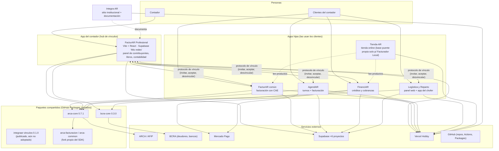

# Ecosistema IntegraAR — mapa global (estado al 08/10/2026)

> **Este es el documento de entrada.** Si abrís una sesión nueva para trabajar sobre más de una app, leé este archivo primero y después el `ESTADO`/`PENDIENTES` de la app que vayas a tocar.
> Se mantiene en el repo `Integra-AR` (el sitio institucional) porque es el único que no pertenece a ninguna app. Cuando cambie algo que cruza apps (vínculos, paquetes, backups, CI, secretos), se actualiza **acá y en el repo afectado**.
> Nunca se guardan valores de secretos en estos archivos: solo sus nombres y dónde viven. Los archivos `SECRETOS_*.md` de cada repo están fuera de git a propósito.

---

## 1. Qué es

IntegraAR es un conjunto de aplicaciones para pymes y profesionales argentinos con integración real a ARCA/AFIP y Mercado Pago. Hay **una app para el contador** (FacturAR Profesional) y **apps "hijas"** que usan los clientes del contador. El contador invita a un cliente desde Profesional; el cliente acepta desde su app hija y desde ahí el contador opera con él.

### Organigrama

---

## 2. Las aplicaciones

| App | Repo (GitHub `tustylovt-ui/…`) | Carpeta local (`C:\Desarrollo Integrar\…`) | Rama | Stack | Vercel (proyecto · URL) | Supabase (project ref · cuenta) |
|---|---|---|---|---|---|---|
| **FacturAR Profesional** (contador) | `FacturAR-Profesional` | `FACTURAR\FacturAR-Profesional` | `main` | Vite 7 + React 18 | `facturar-profesional` · facturar-profesional.vercel.app | `pvukzwxwbzkmspdgjoqw` · "Mis redes" |
| **FacturAR común** (núcleo) | `FacturAR` | `FACTURAR\FacturAR` | `main` | Vite 7 + React 18 | `factur-ar` · factur-ar.vercel.app | `tehgzhnpcicuucwdefjm` · IntegraAR |
| **AgendAR** | `AgendAR` | `AGENDAR\AgendAR` | `main` | Next 16 + React 19 | `agend-ar` · agend-ar-pi.vercel.app | `fkbspjyoawjwuthfhgvs` · IntegraAR |
| **FinanciAR** | `FinanciAR` | `FINANCIAR\FinanciAR` | `main` | Next 15 + React 19 | `financi-ar` · financi-ar.vercel.app | `izprfefxvwsjtnmpempi` · IntegraAR |
| **Logística y Reparto** (LR) | `Logistica-y-Reparto` | `LOGISTICAYREPARTO\Logistica-y-Reparto` (`dashboard-web/` + `app-repartidor/`) | **`master`** | Next 16 + React 19; app del chofer en Expo 57 | `logistica-reparto` · dashboard-web-five-rho.vercel.app | `mnuilbwxanbhnlrblitu` · "Inversiones" |
| **Tienda-AR** | `Tienda-AR` | `TIENDAAR\Tienda-AR` | `main` | Next 15 | `tienda-ar` | `afbuaxrccittcfhbcwoi` · misma cuenta que FinanciAR. **Base puente propia solo para Facturador Local** (origen `d`: `tienda_config`, `tienda_productos`, `tienda_pedidos`, `v_tienda_publica`). Para FacturAR (`f`) y FinanciAR (`c`) lee y escribe directo en las bases de esas apps. |
| **Integra-AR** (sitio + docs) | `Integra-AR` | `INTEGRAAR\Integra-AR` | `main` | HTML estático | `integra-ar` | — |

Notas que cambian cómo se trabaja:
- **LR tiene dos copias locales con roles distintos:** `…\LOGISTICAYREPARTO\Logistica-y-Reparto` es el trabajo diario (código, migraciones, backups); `C:\dev\lr` es **solo para compilar la app del chofer** (ruta corta por el límite de 260 caracteres de Windows; tiene `android/` y los `.env.local`). No editar código en las dos a la vez.
- **FacturAR Profesional tiene dos remotos** (`origin` = Profesional, `upstream` = núcleo). `gh` quedó fijado a Profesional con `gh repo set-default`. En los demás repos pasar siempre `--repo` si hay dudas.
- **Las cuentas de Supabase son tres** (IntegraAR, "Mis redes", "Inversiones"): para mirar una base hay que tener abierta la cuenta correcta en el navegador; el MCP de Supabase solo ve algunas. **Desde el 08/10/2026 hay 4 conectores MCP locales con token propio** (los tokens viven en la configuración de la app de escritorio, nunca en estos documentos): `supabase-agendar-facturar` (FacturAR común `tehgzhnpcicuucwdefjm` + AgendAR `fkbspjyoawjwuthfhgvs`), `supabase-misredes` (Profesional `pvukzwxwbzkmspdgjoqw`), `supabase-financiar-tienda` (FinanciAR `izprfefxvwsjtnmpempi` + base puente de Tienda-AR `afbuaxrccittcfhbcwoi`) y `supabase-lr-finanzas` (LR `mnuilbwxanbhnlrblitu` + "Finanzas Personales" `xgsdbkxerbttybyuclwp`, esta última pausada y ajena al ecosistema). Un conector de claude.ai ve también LR. Si un token vence o se revoca, el conector responde `Unauthorized`.
- **Cuenta de prueba de FinanciAR = misma identidad fiscal que la del dueño en FacturAR común** (CUIT 20258523173, mismo certificado): cualquier emisión de prueba es real (CAE real) y comparte numeración. Pedir OK antes de emitir.

---

## 3. Paquetes compartidos (carpeta `Logica Arca\`)

Se publican como paquetes **privados** en GitHub Packages (`@tustylovt-ui/…`). Para instalarlos hace falta `GH_PACKAGES_TOKEN` (en local, exportarlo en la terminal; en CI, secret del repo; en Vercel ya está en todos los entornos).

| Paquete | Versión | Qué hace | Lo usan |
|---|---|---|---|
| `arca-core` | 0.7.1 | Reglas y utilidades ARCA: tipos de comprobante, IVA, QR RG 4291, TokenCache, catálogo de reglas, comprobantes asociados RG 4540 (subpath `/asociados`; **el front nunca importa la raíz del paquete**) | núcleo 0.7.0 · Profesional 0.7.0 · AgendAR 0.7.1 · LR 0.7.1 · **FinanciAR 0.5.0 (a propósito: no emite NC/ND)** |
| `arca-facturacion` / `arca-common` | 0.1.0 | Fork propio del SDK de ARCA (la cuenta `ramiidv` **no** es propia) | vía `arca-core`; AgendAR y LR lo declaran directo |
| `bcra-core` | 0.3.0 | Central de Deudores, CUIT y tabla de bancos (nombres completados con padrón A5 y API de cheques; `soloCheques`, `incompleto`) | Profesional 0.3.0 · FinanciAR 0.1.1 (solo usa deudores y CUIT) |
| `integraar-vinculos` | 0.1.0 | Contrato del protocolo de vínculo v2, firma por par, registro de apps y capacidades | **Publicado pero ninguna app lo adoptó todavía** (etapa A1 del plan `PLAN_PAQUETES_VINCULOS_Y_SCRAPING.md`). Hoy el protocolo vive duplicado en el código de cada app. |

Cada paquete se publica por GitHub Actions al crear un tag `vX.Y.Z`. Planes y decisiones: `Logica Arca\PLAN_*.md`.

---

## 4. Cómo se conectan: el protocolo de vínculo contador ↔ cliente

Documento técnico completo: [`PROTOCOLO_VINCULO_CONTADOR.md`](PROTOCOLO_VINCULO_CONTADOR.md). Resumen operativo vigente:

**Piezas**
- `vinculos_contador` (Profesional): el vínculo **maestro** (contador, contribuyente, estado `PENDIENTE/ACTIVO/REVOCADO`, código de invitación).
- `vinculos_contador_apps` (Profesional): una fila por app hija del vínculo (`financiar`, `agendar`, `logisticayreparto`, `facturar_comun`) con su estado (`ACTIVO/PENDIENTE/ERROR/REVOCADO`).
- `vinculos_contador_externo` (en **cada app hija**): el lado receptor de la invitación (código, estado, usuario que aceptó).
- Todo lo server-to-server viaja con el secreto compartido `INTEGRAAR_INTERAPP_SECRET` (cabecera `X-IntegraAR-Secret`), nunca con datos del navegador.

**Flujo de alta**
1. El contador usa "Invitar contribuyente" en Profesional (nombre, email **opcional**, apps a vincular).
2. Profesional crea el vínculo maestro y le pide a cada app tildada que cree su invitación (`vinculo_externo_crear`).
3. El cliente abre el link `/acceso/<código>` de su app hija, inicia sesión o se registra y acepta.
4. La app hija avisa a Profesional (`notificar_activacion_externa`) **con el email de la cuenta con que aceptó** (`datos.email`; agregado el 08/10/2026 en FinanciAR, AgendAR, LR y FacturAR común).
5. Profesional crea (o reutiliza) la cuenta interna del cliente por email y deja el vínculo maestro **ACTIVO**: queda **una sola tarjeta** en el panel con todo (vinculación total), con una etiqueta por app junto al nombre.

**Flujo de baja (desde 08/10/2026 siempre es TOTAL, venga de donde venga)**
- *Contador desde el panel:* el "Desvincular" de cualquier tarjeta corta **todas las apps vivas del cliente y el vínculo nativo**, y la tarjeta desaparece.
- *Cliente desde su app hija:* la app avisa (`notificar_desvinculacion_externa`) y Profesional corta **las demás apps y el vínculo nativo** (`api/_lib/desvinculacionTotal.js`).
- *Cliente desde Profesional ("Desvincularme"):* mismo corte total.
- **Guarda de cuenta compartida:** si el mismo contribuyente tiene **otro vínculo activo**, la baja no lo degrada a INDEPENDIENTE ni cancela sus suscripciones (caso real: la cuenta del dueño está en dos vínculos).
- Una app que no responde al corte queda en `ERROR` y se informa en el log; el resto igual se corta.

**Probado en producción el 08/10/2026 con FinanciAR:** alta sin email en la invitación → tarjeta ACTIVA en 2,5 s; baja desde el cliente → todo REVOCADO en 1,2 s; baja desde el panel → todo REVOCADO en 1,6 s; la cuenta compartida quedó intacta. **Baja iniciada por el cliente desde FacturAR común, probada el 09/10/2026 (12:36 UTC) con la cuenta del dueño:** vínculo `d7512b6a…` y su app REVOCADOS en Profesional, invitación REVOCADA en el núcleo, rol pasó a `INDEPENDIENTE` (no tenía otro vínculo activo); los vínculos de MARCELA y de LR no cambiaron. Con esto la baja iniciada por el cliente quedó probada en las cuatro apps hijas. Para volver a operar hay que re-invitar desde Profesional. **09/10/2026 con AgendAR:** baja desde el panel del contador → vínculo, app e invitación REVOCADOS en las dos bases, vínculo de FacturAR común y rol del contribuyente intactos (guarda de cuenta compartida); alta nueva → tarjeta ACTIVA. **Baja iniciada por el cliente desde Logística y Reparto, probada el 09/10/2026 (05:40 UTC):** mismo resultado (vínculo, app e invitación REVOCADOS en las dos bases; cuenta compartida intacta). **Datos fiscales en la activación (09/10/2026):** AgendAR y LR ahora informan CUIT, razón social y condición además del email (`datos`), como FacturAR común; verificado en producción con LR (la tarjeta pasó de CUIT `PENDIENTE` a los datos reales y muestra el botón ARCA). **Baja iniciada por el cliente desde AgendAR, probada el 09/10/2026 (05:19 UTC):** vínculo `0b272d08…` y su app REVOCADOS en Profesional en ~1 s, invitación REVOCADA en AgendAR, vínculo de FacturAR común y rol del contribuyente intactos; logs de Profesional sin errores (solo el aviso `DEP0169`).

**Tarjeta del panel (09/10/2026):** una sola tarjeta por vínculo. La app de datos del cliente (FacturAR común, o la primera activa con comprobantes/emisión: AgendAR, Logística y Reparto) se absorbe como etiqueta en "Vinculación total" y la tarjeta opera sobre ella; ya no hay una segunda caja con otro Desvincular.

---

## 5. Infraestructura transversal

**CI (GitHub Actions)** — todos los repos con paquetes privados necesitan el secret `GH_PACKAGES_TOKEN` y pasarlo a `npm ci` (`env:`). Estado al 08/10/2026: verde en núcleo, Profesional, AgendAR, FinanciAR y LR. Los pre-push (Husky) corren tests + build en cada repo.

**Lint** — `0 errores` en los cinco; los avisos no bloquean. Quedan avisos como deuda: AgendAR 83 (33 `set-state-in-effect`, 45 `exhaustive-deps`), FinanciAR 239 (198 `no-explicit-any`), LR 21. FinanciAR **no tenía configuración de ESLint** hasta el 07/10 (el job "informativo" nunca analizaba nada).

**Backups** — cinco tareas de Windows semanales (se ejecutan al encender la PC si estaba apagada), JSON local con retención de 8, carpeta `backups/` ignorada por git:

| App | Tarea | Hora (lunes) | Cobertura |
|---|---|---|---|
| AgendAR | `AgendAR Backup Supabase` | 21:00 | tablas |
| LR | `LR Backup Supabase` | 21:30 | 17 tablas + 4 buckets de Storage |
| FacturAR común | `FacturAR Comun Backup Supabase` | 22:00 | 45 tablas |
| Profesional | `FacturAR Profesional Backup Supabase` | 22:15 | 53 tablas (incluye todo el módulo contable) |
| FinanciAR | `FinanciAR Backup Supabase` | 22:30 | 30 tablas + 4 buckets de Storage |

Quedan fuera a propósito: vistas `v_*` y cachés reconstruibles. **Scripts de restauración** (`scripts/restaurar-backup.mjs`): las cinco apps con base propia, **probadas de punta a punta el 09/10/2026** sobre un proyecto Supabase descartable (esquema reconstruido + `--ejecutar`: 0 errores, huella de `id` idéntica al backup): FinanciAR 68 filas y 6 archivos, LR 458 filas y 4 archivos, AgendAR 33 filas y 6 archivos, Profesional 1.583 filas y 1 archivo, núcleo 543 filas y 16 archivos. Los de AgendAR (PR #25, mergeado), Profesional (#31 mergeado, #32 pendiente) y núcleo (#17 pendiente de merge) salen de una plantilla común generada del catálogo real (`TABLAS`, `FKS`, `PK`, `DIFERIDAS`, `GENERADAS`, `SOLO_SI_VACIA`, `CONTADORES_POR_TRIGGER`, `EXTRAS_DE_TRIGGER`, `SECUENCIAS`, `BUCKETS_CONOCIDOS`). Trampas de triggers resueltas: `handle_new_user` (crea `usuarios`/`professionals` al crear el usuario de Auth: se restauran por clave natural o se borran los de relleno), `trg_incrementar_uso` (infla `uso_mensual`: se restaura después y se limpia), bloqueo de período (`periodo_bloqueado_hasta` al final), asientos balanceados (partidas por lote de asiento), identidad `GENERATED ALWAYS` (`estudio_auditoria` solo si el destino está vacío), secuencias (el script imprime el SQL). **Reconstruir el esquema:** Profesional y núcleo NO se pueden armar desde `migraciones/` (a Profesional le faltaban las 01-16 y la 17: el PR #32 las versiona; núcleo empieza el 22/06 y sus tablas originales vienen del panel: usar `scripts/exportar-esquema.sql`, que genera el esquema real desde el catálogo). AgendAR: el trigger `on_auth_user_created` no está en su baseline y hay que recrearlo antes de restaurar. **Regla (09/10/2026): todo cambio de base de datos actualiza en el mismo PR los scripts de backup y restauración** (§8; está en el `CLAUDE.md` de cada repo). Hallazgos de la prueba: FinanciAR restauraba mal `plan_config`/`politicas_riesgo` (los triggers de `organizations` crean filas por defecto y las organizaciones `pro` volvían como `free`: corregido); el baseline de FinanciAR no se aplica tal cual en una base vacía (`check_function_bodies = off`), le faltan 2 cambios que viven en Tienda-AR y ~16 `ON DELETE`; LR tenía una migración registrada en producción sin archivo en el repo (`0010a`, agregada).

**Migraciones** — el repo debe coincidir con `supabase_migrations.schema_migrations` (nombre y versión). Verificado el 07/10: AgendAR, FinanciAR y LR coinciden; LR tiene `0025a_vinculos_contador_externo.sql` como *reconstrucción* verificada (la tabla existía sin migración registrada).

**Límites que ya costaron caro**
- Vercel Hobby: máximo **12 funciones serverless** por proyecto; si hay que sumar un endpoint se agrega un `servicio` a `arca-herramientas.js` (núcleo/Profesional) o un campo discriminador a una ruta existente.
- Vercel Hobby retiene **1 hora** de logs de runtime: si hay que investigar algo, hacerlo enseguida.
- Vistas Supabase pensadas para `anon` necesitan `security_invoker = false`.
- Las sesiones PWA cachean: tras un deploy, desregistrar el service worker antes de verificar en pantalla.
- En Windows: Python escribe CRLF (usar `newline=''`), los heredocs de bash rompen comillas y barras (escribir scripts con una herramienta de archivos).

---

## 6. Estado de salud por app (08/10/2026)

| App | CI | Lint | Tests | Migraciones = base | Backup | Documentos |
|---|---|---|---|---|---|---|
| Profesional | ✅ | 0 errores | 472 | n/d (se aplican por SQL; ver `migraciones/`) | ✅ 53 tablas | `PENDIENTES.md` al día |
| FacturAR común | ✅ | 0 errores (no bloqueante en CI) | ✅ | n/d | ✅ 45 tablas | `PENDIENTES`, `README`, `BACKUPS`, `ARCA_SCRAPING`… al día |
| AgendAR | ✅ | 0 errores / 83 avisos (bloqueante) | 87 | ✅ | ✅ | al día |
| FinanciAR | ✅ | 0 errores / 239 avisos (bloqueante) | 173 | ✅ 31/31 | ✅ 30 + Storage | `PENDIENTES.md` con resumen verificado arriba |
| LR | ✅ (+ job `rls`) | 0 errores / 21 avisos | 75 | ✅ 38 archivos | ✅ 17 + Storage | `README.md` es el estado (sección "Relevamiento del 07/10/2026") |
| Tienda-AR | ✅ (desde el 09/10/2026: tipos + lint + build) | 0 errores / 1 aviso | ❌ no tiene | n/d (SQL manual, `migraciones/`) | ❌ la base puente **no tiene backup** (vacía, verificado 09/10/2026) | `ESTADO_TIENDAAR.md` + `README.md` (base puente corregida el 08/10/2026) |

---

## 7. Pendientes abiertos (consolidado, por prioridad)

**Seguridad y mantenimiento (tuyos / urgentes)**
1. Rotar el token personal de GitHub (`ghp_…`) que se pegó una vez en un chat.
2. Renovar `PACKAGES_READ_TOKEN` / `GH_PACKAGES_TOKEN` **antes del 02/01/2027** (vencen) y recargarlos en los repos y en Vercel.

**Pruebas que faltan (necesitan OK explícito cuando son emisiones reales)**
3. ~~Baja iniciada por el cliente desde las apps hijas~~ ✅ probada en FinanciAR (08/10), AgendAR, LR y FacturAR común (09/10/2026; para esta última se usó la cuenta del dueño, que quedó desvinculada; usar una cuenta de prueba aparte, no la del dueño). **Cuidado con esta prueba:** en el núcleo (`api/_lib/ecosistemaReceptor.js`) aceptar una invitación nueva revoca de su lado **todos** los vínculos activos previos de esa cuenta sin avisar a Profesional (queda ACTIVO allá: inconsistencia entre bases), y `desvincularme` da de baja **todos** los vínculos activos de la cuenta y avisa uno por uno. Con la cuenta del dueño (`fagottijorger@gmail.com`, vínculo operativo `d7512b6a`, único de ese contribuyente) la baja cortaría ese vínculo y el rol pasaría a `INDEPENDIENTE`. Recomendado: una cuenta de FacturAR común de prueba nueva (el vínculo de MARCELA `6b7cf020` es de un cliente real: no tocar). Si se toca el núcleo, evaluar que `activar` avise a Profesional al revocar los vínculos previos.)
4. Emisión real de NC y ND en Logística y Reparto y en AgendAR (Profesional/núcleo ya validado con monotributista y RI).
5. Probar en pantalla el lápiz de edición del Libro IVA en el núcleo.
6. ~~`restaurar-backup.mjs --ejecutar` sobre una base descartable (LR y FinanciAR)~~ ✅ 09/10/2026. Queda: borrar el proyecto descartable `restauracion-prueba-descartable` (`zqmxxfymgnxvrrvtvccm`, cuenta "Mis redes"), que tiene copias de datos reales de las cinco apps (incluidos certificados de `arca_config`); lo borra el dueño (Settings → General → Delete project) junto con los `restaurar-*-descartable.ps1` y `limpiar-buckets.mjs` de `C:\Users\Jorge`.

**Producto / arquitectura**
7. Adoptar `integraar-vinculos` en las apps (etapa A1: firma por par, registro de apps, receptor/emisor, conformidad) para dejar de duplicar el protocolo.
8. Profesional: traer las ventas emitidas por las apps hijas al Libro IVA Ventas; completar la integración del módulo contable con el contador.
9. FinanciAR: limitación de `resolverReceptor` con Monotributista que tiene CUIT; tipar los 198 `any`; sin NC/ND y sin subir `arca-core` por decisión (reabrir solo si el dueño lo pide).
10. AgendAR: 33 `set-state-in-effect` y 45 `exhaustive-deps` (revisar caso por caso, hay candidatos a bugs reales).
11. `bcra-core`: CUIT de 10 entidades `soloCheques`, "Galicia S.A. vs S.A.U.", refrescar el directorio BCRA cada mes, ajuste cosmético de `marca` (0.3.1).
12. Backups: **la base puente de Tienda-AR (`afbuaxrccittcfhbcwoi`) no tiene tarea de backup, pero el 09/10/2026 se verificó que está VACÍA (0 tiendas, productos, pedidos y archivos): no hace falta hasta que Facturador Local la use** (si Facturador Local la usa, sus tiendas y pedidos solo viven ahí; verificar primero si tiene datos reales); ~~scripts de restauración y Storage en los backups de núcleo, Profesional y AgendAR~~ ✅ 09/10/2026 (probados; faltan mergear Profesional #32 y núcleo #17); respaldar la configuración de Auth.
13. Ruido de logs: aviso `DEP0169` (`url.parse()`) en las funciones de Profesional (viene de una dependencia; investigar de dónde).
14. Tienda-AR (relevado el 08/10/2026, parcialmente resuelto el 09/10/2026): se agregó CI y `next` 15.5.27 con `npm audit fix` (vulnerabilidades de producción 7 → 4, sin críticas). Pendiente: `mercadopago` 3.x (cambio mayor, afecta el cobro) y Next 16 para lo que queda, tests del checkout y `zod` declarado sin uso. Detalle en `Tienda-AR\ESTADO_TIENDAAR.md`.
15. "Leaked password protection" de Supabase Auth requiere plan Pro (bloqueado por plan).

---

## 8. Acuerdos de trabajo (cómo se opera con Claude y entre apps)

- **Una app a la vez**, con rama + PR + CI en verde + OK explícito del dueño antes de mergear a la rama principal. Commits con `Co-Authored-By: Claude …`.
- **Pedir OK explícito** antes de: emisiones fiscales reales (CAE), migraciones/UPDATE/DELETE en producción, publicar secretos.
- **Los secretos los carga el dueño** en GitHub/Vercel/Supabase; Claude prepara el formulario con el nombre y el valor vacío. No se pegan tokens en el chat.
- **Probar cambios del ecosistema = deploy real + prueba en el navegador + verificar ambas bases + documentar** (ver `FacturAR\…\PENDIENTES.md` y la memoria del proyecto).
- **Cambios de base de datos ⇒ copia de seguridad (regla del 09/10/2026).** Toda modificación de una base de datos (migración, SQL a mano o panel de Supabase) debe actualizar **en el mismo PR**: la lista `TABLAS` (y buckets de Storage) de `scripts/backup-supabase.mjs`; en las apps que lo tienen (FinanciAR, LR) también `TABLAS`, `FKS`, `PK`, `DIFERIDAS` y `BUCKETS_CONOCIDOS` de `scripts/restaurar-backup.mjs`; la migración versionada con el mismo nombre y versión registrados en `schema_migrations`; y los números de `BACKUPS.md`/README. Si un trigger inserta filas por defecto en otra tabla, esa tabla se restaura por su clave natural. La regla está escrita en el `CLAUDE.md` de FacturAR, Profesional, AgendAR, FinanciAR, Logística y Reparto y Tienda-AR (se carga sola en cada sesión de Claude Code). Verificación: correr el backup, comparar `TABLAS` con `/rest/v1/` de PostgREST y correr la simulación de restauración.
- **Verificar antes de afirmar:** los documentos se corrigen contra el código y la base reales; los `.md` locales no versionados (`ESTADO_*`, `SECRETOS_*`) no se dan por actualizados sin mirarlos.
- Los repos usan finales de línea CRLF en Windows (`autocrlf`): los scripts que editan archivos deben respetarlos.

---

## 9. Dónde leer más

| Tema | Archivo |
|---|---|
| Protocolo de vínculo (contrato, endpoints, rollout) | `Integra-AR\PROTOCOLO_VINCULO_CONTADOR.md` |
| Lecciones operativas históricas (junio 2026; leer con este documento al lado) | `Integra-AR\GUIA_CLAUDE_ECOSISTEMA.md` |
| Sitio institucional | `Integra-AR\ESTADO.md` |
| Profesional: pendientes e historia detallada; qué es la variante | `FacturAR-Profesional\PENDIENTES.md`, `VARIANTE_PROFESIONAL.md`, `LEEME_VARIANTE.md`, `ARCA_SCRAPING.md`, `MAPA_DEPENDENCIAS_MODULOS.md` |
| Núcleo: pendientes, scraping ARCA, mapa de módulos, backups, recuperación | `FacturAR\PENDIENTES.md`, `ARCA_SCRAPING.md`, `MAPA_DEPENDENCIAS_MODULOS.md`, `BACKUPS.md`, `RECUPERACION_DESASTRES.md` |
| AgendAR / FinanciAR | `AgendAR\PENDIENTES.md` + `DESARROLLO.md`; `FinanciAR\PENDIENTES.md` (resumen verificado arriba) + `BACKUPS.md` + `migraciones\README.md` |
| LR | `Logistica-y-Reparto\README.md` |
| Paquetes y planes | `Logica Arca\PLAN_PAQUETE_ARCA_COMPARTIDO.md`, `PLAN_FORK_ARCA_SDK.md`, `PLAN_PAQUETES_VINCULOS_Y_SCRAPING.md` y el README/CHANGELOG de cada paquete |
